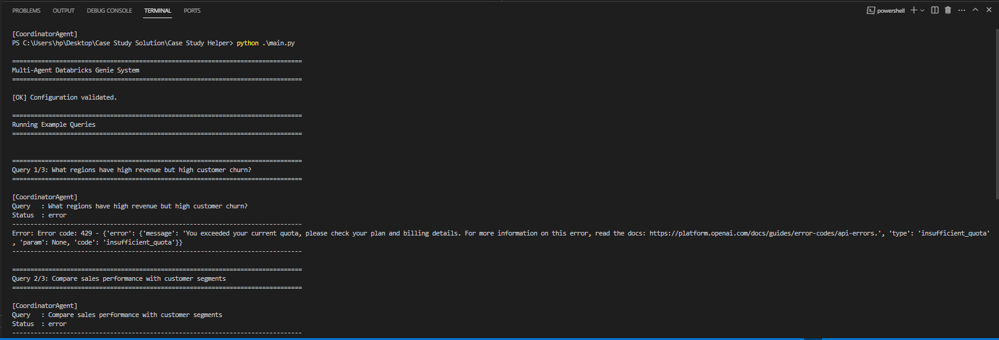

# Multi-Agent System using Databricks Genie

A lightweight multi-agent system built with **LangChain** and **Databricks Genie**, designed to analyze **Sales** and **Customer** data across two Databricks workspaces and generate combined insights.

---

## Setup

**Install dependencies**

```bash
pip install -r requirements.txt
```

**Add environment variables** in a `.env` file:

```
DATABRICKS_HOST=<your-workspace-url>
DATABRICKS_TOKEN=<your-access-token>
SALES_GENIE_SPACE_ID=<sales-space-id>
CUSTOMER_GENIE_SPACE_ID=<customer-space-id>
OPENAI_API_KEY=<openai-key>
```

---

## Run

Run sample queries:

```bash
python main.py
```

Run in interactive mode:

```bash
python main.py interactive
```

---

## How It Works (High Level)

* **Sales Agent** → Fetches sales insights
* **Customer Agent** → Fetches customer/churn insights
* **Coordinator Agent** → Combines results from both and gives unified answers

Example query:

> “Which regions have high revenue but high churn?”

---

## Structure

```
agents/
 ├── base_agent.py
 ├── sales_agent.py
 ├── customer_agent.py
 └── coordinator.py
main.py
config.py
requirements.txt
```

---

## Example Output

```
Query: Which regions have high revenue but high churn?

Insight:
- North: High revenue, low churn
- South: Medium revenue, high churn
```


---

